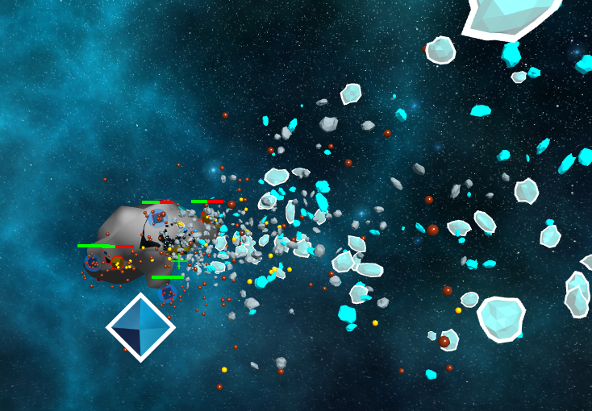

# Interstellar-Demolition-Office
Destructible Terrain Space Bullet Hell Shooter Demo, built with the Three.js game engine as a cross-platform browser-based proof of concept.

[Click here to play the Demo in itch.io](https://sdsds222.itch.io/interstellar-demolition-office)

[Click here to play the Demo](https://sdsds222.github.io/Interstellar-Demolition-Office/)

Players pilot a spacecraft and fire two types of ammunition to destroy mineral voxels on the planet's surface.

Once destroyed, mineral voxels shatter into debris, exposing buried enemy facilities.

Players must collect special reward minerals from the debris to replenish their health and energy bars.

Gold shards restore Energy (required for Heavy Shots).

Crystal shards restore Health.

After destroying all enemy units, the core is unlocked.

The core contains dense enemy installations; defeating all of them completes the level.

This game is made by sdsds222

